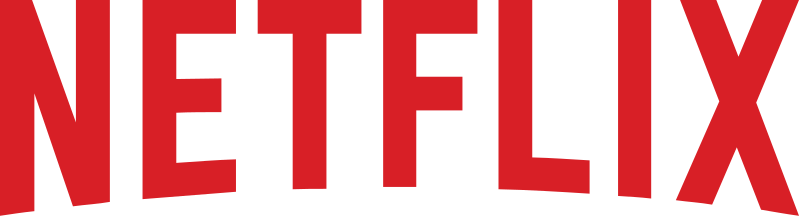

# DevSecOps Netflix Clone 🎬

This project is a secure Netflix Clone deployed using Kubernetes, Docker, GitHub Actions, ArgoCD, and other DevSecOps tools.

---

## 📸 Screenshots

### 🎥 Home Page UI

---

### 🎯 Grid Genre Section

---

### 🎞️ Detail Modal

---

### 📺 Mini Portal

---

### 🚀 DevSecOps Pipeline Preview

---

### 🎬 Netflix Logo

---

### 👁️ Watch Button Overlay

---

## 🛠 Tech Stack

- React.js
- Node.js
- Docker & Kubernetes
- GitHub Actions
- ArgoCD
- NGINX
- AWS EC2
