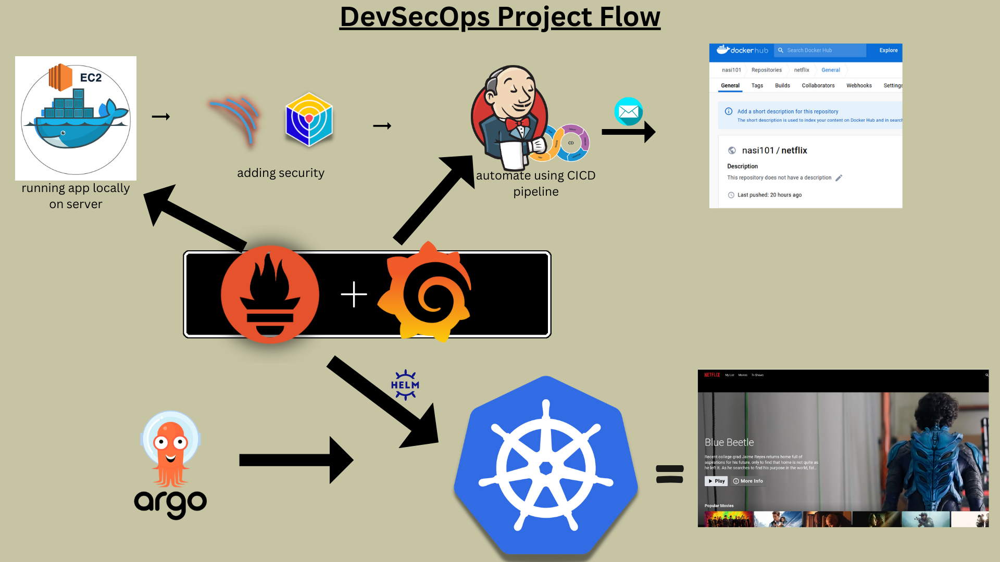

## 📊 DevSecOps Project Flow

  

# Assets in `/public/assets` Folder

This folder contains the following image assets used in the project:

| Image Name          | Preview                         |
|---------------------|--------------------------------|
| DevSecOps.png       |   |
| detail-modal.png    |  |
| favicon.png         |        |
| grid-genre.png      |  |
| home-page.png       |    |
| mini-portal.png     |  |
| netflix-logo.png    |  |
| watch.png           |             |

---

These images are used across various parts of the project UI for logos, icons, and page designs.
